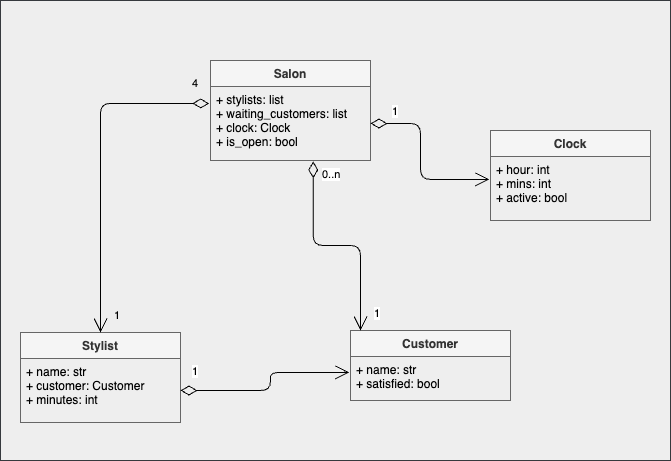
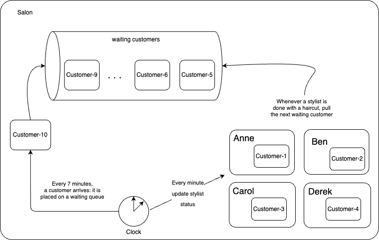

# Hair Salon Coding Challenge

## Problem Specification

### Goal
To simulate a hair salon. 

### Rules

- The hair salon is open for 8 hours, from 9am to 5pm. 
- The program shouldn't take that long to run, so it needs to somehow simulate real time.
- When the salon opens, there are 4 hair stylists who start their shift: Anne, Ben, Carol, and Derek.
- Customers arrive every 7 minutes and are named successively starting at Customer-1. 
- When a customer enters, if a stylist is available, they immediately start cutting the customer’s hair. Otherwise, the client waits for a stylist. 
- A stylist can only cut one person’s hair at a time, and takes 30 minutes to do so.
- After a stylist is done with a customer, the customer leaves satisfied. 
- Stylists can go home after 5pm. They end their shift as soon as they can, unless they are busy with a client. In that case, they wait until they finish with that client, and then end their shift. 
- When all the stylists and customers have gone home, the salon closes. If there are any customers left waiting for a stylist, they are kicked out, and leave furious.

### Input/Output
Your program should print events in chronological order, prefixed with [Time]; where [Time] is salon-time in the format HH:MM, not real time.

#### Sample output:

```
09:00 Hair salon opened
09:07 Customer-1 entered
09:07 Anne started cutting Customer-1’s hair
09:14 Customer-2 entered
...
09:37 Anne ended cutting Customer-1’s hair
09:37 Customer-1 left satisfied
...
```
## Usage

```
make run
```

## Running Tests

```
make test
```

## Design

All the logic necessary to simulate the hair salon is defined in 4 classes:



### Clock
An abstraction representing the passage of time during the Salon's business hours.  It allows to simulate an entire work day by using one
second to represent a "virtual" hour.  Thus, every 60th of a second,
a "minute" goes by at the salon.

When started, a Clock instance receives a list of listener callbacks: every "virtual minute", the clock notifies to all its register listeners, so that they can perform any time sensitive actions.  

Think of this clock as a wall clock beeping every minute, causing all stylists to turn their heads to look at the clock, to check if 30 minutes have elapsed.

### Customer
A simple data class representing a customer.  It encapsulates minimal state: a customer's name (for logging purposes) and a satisfaction status.  A customer can be in one of two (implicit) states: waiting for a haircut in a queue, or in the
process of having a haircut by a stylist.

### Stylist
Represents a hair stylist working at the salon.  A Sylist has the following properties:
- name: textual string uniquely identifying the Stylist
- customer: the customer currently assigned to the stylist, or None if the stylist is free
- minutes: the number of minutes remaining before the current haircut is finished.

### Salon
This is the main abstraction, where most of the action is happening.  A salon is composed of:
- a list of 4 Stylists: the employees currently working at the salon.
- a waiting list of customers: everytime a customer comes into the Salon it joins
this queue if no sylists are avialable.  As soon as a stylist becomes free, the next customer in line will be invited for a haircut.
- a clock: keeps track of the passage of time, notifiying different parts of the
salon to process significant events.

## Event Workflow

The following diagram shows the occurence of various events at the Salon:



Initially, a Salon is assigned its 4 Stylists: Anne, Ben, Carol and Derek.  Then the Salon opens for business: this starts the Salon's clock.  Every minute, the clock notifies the Salon: this causes two type of events to take place at different times:

1) sylist progress check: each engaged stylist makes progress with a haircut, checking if the haircut is finished.  Whenever a Stylist finishes with a 
haircut, it sends the current "Satisfied" customer out the door, and takes the next (if any) waiting customer;

2) new customer arrival: every 7 minutes a new customer arrives at the salon.  It is automatically placed in a waiting queue; if a stylist is free, the customer is taken off the queue right away.  Otherwise, the customer remains in the queue until a stylist becomes available.

When the salon determines that it has reached its closing time (5 pm), it will wait for all engaged stylists to finish their in-progress haircuts, before officially closing doors.  At this point, all waiting customers are kicked-out of the salon, leaving in a "Furious" mood.